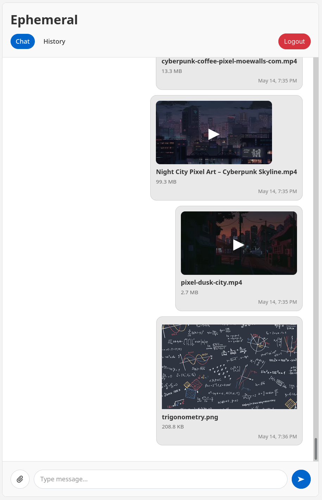
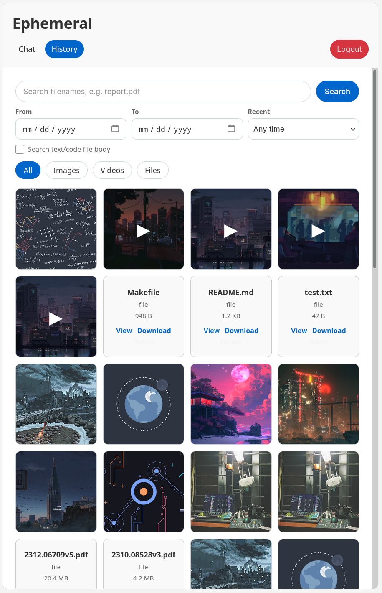

# Ephemeral

Ephemeral is a lightweight self-hosted web app for quickly sharing text messages and files across devices.

<table>
  <tr>
    <td width="50%" align="center">
      
      <br />
      <sub>Chat page</sub>
    </td>
    <td width="50%" align="center">
      
      <br />
      <sub>History page</sub>
    </td>
  </tr>
</table>

## Table of Contents

- [Ephemeral](#ephemeral)
- [Features](#features)
- [Tech Stack](#tech-stack)
- [Requirements (Development Only)](#requirements-development-only)
- [Configuration](#configuration)
- [Docker Deployment](#docker-deployment)
- [Development](#development)
  - [Build and Run Locally](#build-and-run-locally)
  - [Format and Lint](#format-and-lint)

## Features:

- Chat-style feed
- Image and video media viewer with thumbnail preview and browser-friendly video playback copies
- Generic file view/download
- Code and text file viewer with syntax highlighting
- Upload progress queue for file uploads
- History search: type and date filters, filename, text file body search
- Pagination and infinite scrolling
- Mobile-friendly JSON API
- SQLite data persistence
- Docker deployment
- Hot-reload development

## Tech Stack

- Go
- SQLite
- Alpine.js
- HTMX
- HLS.js
- FFmpeg
- Docker & Docker Compose

## Requirements (Development Only)

```bash
go >= 1.21
node >= 20
npm
ffmpeg
air
```

## Configuration

Environment variables:

```env
PORT=8080
DATA_DIR=./data
SESSION_TTL=30d
COOKIE_SECURE=false
TRUSTED_PROXIES=
CHAT_PAGE_SIZE=100
HISTORY_PAGE_SIZE=100
SEARCH_RESULT_LIMIT=30
MAX_UPLOAD_SIZE=2GiB
TEXT_PREVIEW_MAX=10MiB
BODY_INDEX_MAX=20MiB
MEDIA_WORKER_COUNT=1
MEDIA_PROCESS_TIMEOUT=30m
HLS_MIN_SIZE=100MiB
HLS_MIN_DURATION=5m
UPLOAD_CONCURRENCY=1
```

Size values accept bytes or `KB`, `MB`, `GB`, `TB`, `KiB`, `MiB`, `GiB`, `TiB`.
Video uploads are processed asynchronously with FFmpeg. The original file is kept for download, a faststart MP4 playback copy is generated for browser playback, and HLS is generated when either `HLS_MIN_SIZE` or `HLS_MIN_DURATION` is reached. The browser UI uses native HLS when available, HLS.js when MediaSource is available, and MP4 fallback otherwise. Set both HLS thresholds to `0` to generate HLS for every video.
`UPLOAD_CONCURRENCY` is capped at 10. Set `COOKIE_SECURE=true` when serving only over HTTPS. Set `TRUSTED_PROXIES` to comma-separated proxy IPs/CIDRs only when a trusted reverse proxy sets forwarding headers.

Create local env file:

```bash
cp .env.example .env
```

## Docker Deployment

Run with Docker Compose:

```bash
docker compose up -d --build
```

## Development

Install web dependencies:

```bash
make install-web
```

Run with hot reload:

```bash
make dev
```

Go to:

```text
http://localhost:8080
```

### Build and Run Locally

Build:

```bash
make build
```

Run:

```bash
make run
```

Clean binary:

```bash
make clean
```

Delete local app data:

```bash
make clean-data
```

### Format and Lint

Format:

```bash
make format
```

Lint:

```bash
make lint
```

Auto-fix:

```bash
make fix
```
